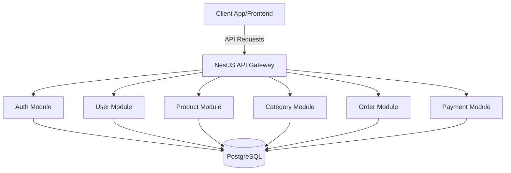

# ProductHub - E-commerce Backend API

ProductHub is a professional, scalable, and high-performance e-commerce backend built with **NestJS**, **Prisma**, and **PostgreSQL**. It provides a robust set of features including authentication, role-based access control, product management, order processing, and payment integration.


---

## 🛠️ Tech Stack
- **Backend**: NestJS (Node.js)
- **Database**: PostgreSQL
- **ORM**: Prisma
- **Payments**: Stripe SDK
- **Security**: Passport.js (JWT), Class Validator, Helmet
- **API Specs**: Swagger / OpenAPI 3.0

---

## 🏛️ High-Level Design (HLD)

The system follows a **Modular Monolith Architecture**, ensuring separation of concerns and ease of maintenance.

### Architecture Overview
- **Framework**: NestJS (Node.js)
- **Database**: PostgreSQL with Prisma ORM
- **Authentication**: JWT (Access + Refresh Tokens)
- **Security**: Role-Based Access Control (RBAC), Rate Limiting, Helmet, CORS
- **Documentation**: Swagger UI (OpenAPI 3.0)

### System Component Diagram


---

## 🏗️ Low-Level Design (LLD)

Each module in ProductHub follows the standard NestJS pattern:
1.  **Controller**: Handles incoming HTTP requests and returns responses.
2.  **Service**: Contains the business logic and interacts with the repository/ORM.
3.  **DTO (Data Transfer Object)**: Defines the shape of data for requests and responses, including validation using `class-validator`.
4.  **Guard**: Protects routes based on authentication and roles.
5.  **Decorator**: Custom decorators for clean code (e.g., `@GetUser()`, `@Roles()`).

### Directory Structure
```text
src/
├── common/                           # Shared utilities & configurations
│   ├── decorator/                    # Custom decorators (GetUser, Roles, Throttler)
│   │   ├── custom-thorttlerdecorator.ts
│   │   ├── get-user.decorator.ts
│   │   └── role.decorator.ts
│   ├── guards/                       # Security guards (JWT, Refresh, RBAC)
│   │   ├── jwt-auth-guards.ts
│   │   ├── refresh-token.guard.ts
│   │   └── user-role-guard.ts
│   └── interfaces/                    # Shared TypeScript interfaces
│       └── request-with-user.interface.ts
├── modules/                          # Business Logic Modules
│   ├── auth/                         # Authentication & Token Management
│   │   ├── dto/                      # Auth Data Transfer Objects
│   │   ├── strategy/                 # Passport JWT strategies
│   │   ├── auth.controller.ts
│   │   ├── auth.module.ts
│   │   └── auth.service.ts
│   ├── user/                         # User Profile & Management
│   │   ├── dto/
│   │   ├── user.controller.ts
│   │   ├── user.module.ts
│   │   └── user.service.ts
│   ├── product/                      # Product Inventory & Management
│   │   ├── dto/
│   │   ├── product.controller.ts
│   │   ├── product.module.ts
│   │   └── product.service.ts
│   ├── category/                     # Product Categorization
│   │   ├── dto/
│   │   ├── category.controller.ts
│   │   ├── category.module.ts
│   │   └── category.service.ts
│   ├── order/                        # Order Processing Lifecycle
│   │   ├── dto/
│   │   ├── order.controller.ts
│   │   ├── order.module.ts
│   │   └── order.service.ts
│   └── payment/                      # Payment Processing (Stripe Integration)
│       ├── dto/
│       ├── payment.controller.ts
│       ├── payment.module.ts
│       └── payment.service.ts
├── prisma/                           # Database ORM Integration
│   ├── prisma.module.ts
│   └── prisma.service.ts
├── app.module.ts                     # Root application module
└── main.ts                           # Entry point (Bootstrap & Swagger Setup)
```

---

## 🛡️ Data Consistency & Transactions

ProductHub prioritizes data integrity across all operations. We utilize **Prisma Transactions** (`prisma.$transaction`) to ensure that multi-step operations are atomic. 

- **Atomic Payments**: When a payment is verified, updating the payment status and the corresponding order/cart status happens within a single transaction. If any step fails, the entire operation is rolled back to prevent inconsistent states.
- **Order Processing**: Stock adjustments and order creation are treated as atomic units to prevent overselling.

---

## 🛣️ API Routes

All routes are prefixed with `/api/v1`.

### 1. Authentication
| Method | Endpoint | Description | Access |
| :--- | :--- | :--- | :--- |
| POST | `/auth/signup` | Register a new user | Public |
| POST | `/auth/login` | Login and get tokens | Public |
| POST | `/auth/refresh` | Refresh access token | Public (Refresh Token) |
| GET | `/auth/logout` | Invalidate tokens | Private (Access Token) |

### 2. User Management
| Method | Endpoint | Description | Access |
| :--- | :--- | :--- | :--- |
| GET | `/user/me` | Get current user profile | User/Admin |
| PATCH | `/user/me` | Update profile | User/Admin |
| PATCH | `/user/change-password` | Update account password | User/Admin |
| DELETE | `/user/me` | Delete own account | User/Admin |
| GET | `/user` | Get all users | Admin |
| DELETE | `/user/:id` | Delete user by ID | Admin |

### 3. Products & Categories
| Method | Endpoint | Description | Access |
| :--- | :--- | :--- | :--- |
| GET | `/product` | List products (filtered/paginated) | Public |
| GET | `/product/:id` | Get product details | Public |
| POST | `/product` | Create new product | Admin |
| PATCH | `/product/:id` | Update product | Admin |
| PATCH | `/product/:id/stock` | Update product stock | Admin |
| DELETE | `/product/:id` | Delete product | Admin |
| GET | `/category` | List categories | Public |
| POST | `/category` | Create category | Admin |
| PATCH | `/category/:id` | Update category | Admin |

### 4. Orders & Payments
| Method | Endpoint | Description | Access |
| :--- | :--- | :--- | :--- |
| POST | `/order` | Place a new order | User |
| GET | `/order` | View own orders | User |
| GET | `/order/:id` | View order details | User/Admin |
| POST | `/payment/payment-intent`| Initialize **Stripe** payment | User |
| POST | `/payment/verify` | Verify **Stripe** payment status | User |

---
---
## 📝 Core Database Tables

### � Users (`users`)
| Field | Type | Description |
| :--- | :--- | :--- |
| `id` | UUID (PK) | Unique identifier for the user |
| `firstName` | String | User's first name |
| `lastName` | String | User's last name |
| `email` | String (UK) | Unique login email |
| `password` | String | Hashed credentials |
| `role` | Enum | Access level (USER/ADMIN) |
| `createdAt` | Timestamp | Account creation date |

### � Products (`products`)
| Field | Type | Description |
| :--- | :--- | :--- |
| `id` | UUID (PK) | Unique product identifier |
| `name` | String | Commercial name |
| `sku` | String (UK) | Stock Keeping Unit |
| `price` | Decimal | Unit price (10,2) |
| `stock` | Integer | Available inventory |
| `categoryId` | UUID (FK) | Reference to Category |
| `isActive` | Boolean | Visibility status |

### 🛒 Orders (`orders`)
| Field | Type | Description |
| :--- | :--- | :--- |
| `id` | UUID (PK) | Unique order identifier |
| `orderNumber`| String (UK) | Human-readable order ID |
| `userId` | UUID (FK) | Reference to User |
| `status` | Enum | Order state (PENDING, etc.) |
| `totalAmount`| Decimal | Final payable amount |
| `cartId` | UUID (FK) | Originating cart |

### 💳 Payments (`payments`)
| Field | Type | Description |
| :--- | :--- | :--- |
| `id` | UUID (PK) | Transaction identifier |
| `orderId` | UUID (FK) | Associated Order |
| `userId` | UUID (FK) | Payer reference |
| `amount` | Decimal | Transaction amount |
| `status` | Enum | Payment state |
| `transactionId`| String | Provider reference (Stripe) |


---

## 🚀 Getting Started

1.  **Clone the repository**:
    ```bash
    git clone <repository-url>
    cd ProductHub
    ```

2.  **Install dependencies**:
    ```bash
    npm install
    ```

3.  **Environment Setup**:
    Create a `.env` file based on `.env.example` and configure your database URL and JWT secrets.

4.  **Database Migration**:
    ```bash
    npx prisma migrate dev
    ```

5.  **Run Application**:
    ```bash
    # Development mode
    npm run start:dev
    
    # Production mode
    npm run start:prod
    ```

6.  **API Documentation**:
    Once the server is running, visit `http://localhost:3000/api/docs` to view the interactive Swagger documentation.

---

## 📜 License
This project is [MIT licensed](LICENSE).
